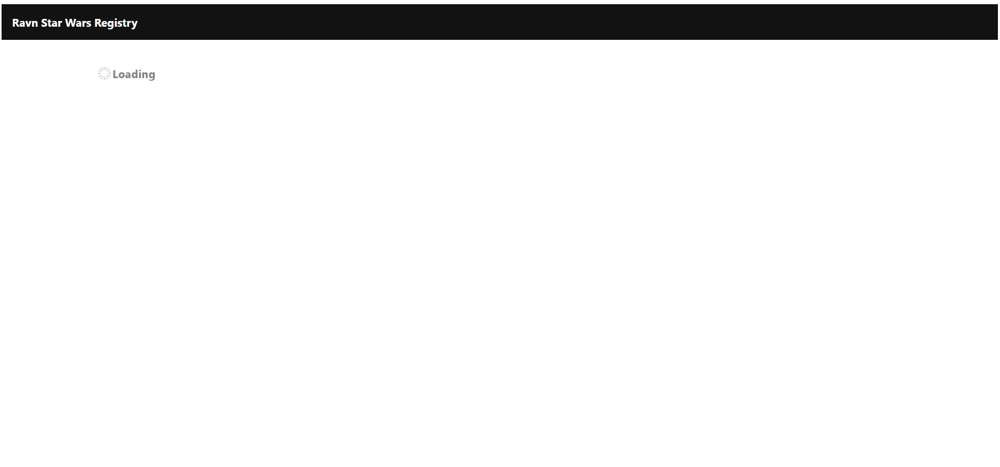
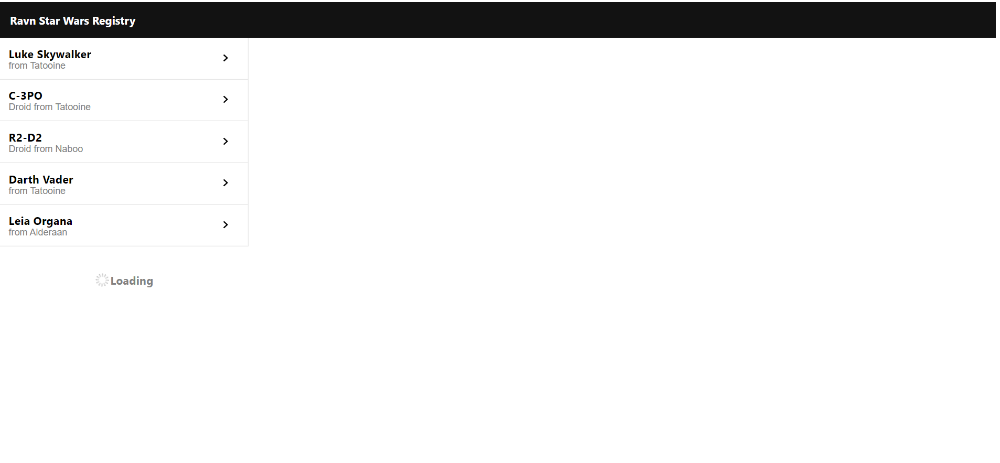
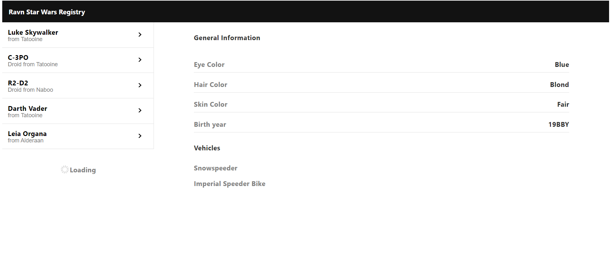

# Ravn Challenge

The project is a challenge made by RAVN for new applicants. The project is made using React Js Library, WebPack, Apollo Client, GraphQL, Prettier, Eslint and SASS. 

## Requirements

This project requires npm.


## How Start

1. The project is public, so clone this repo and place in the root project.

2. Run this command to install the dependencies:

```bash
    npm i
```

3. When the dependencies are already installed, run this command.

-Start in local development mode:
```bash
    npm run start
```

-To see the project, please open in your browser:

```bash
    http://localhost:3005/
```

-Compile in production mode

```bash
    npm run build
```

## Flow
1. App start loading de page.
 
2. It shows 5 characters in the sidebar.
  
3. It shows the data cointained in every character.
   


## Dependencies and Technologies


## Configurations
### Webpack

  You could change the config about the project, go to 'webpack.config.js' file.

## License
[MIT](https://choosealicense.com/licenses/mit/)
